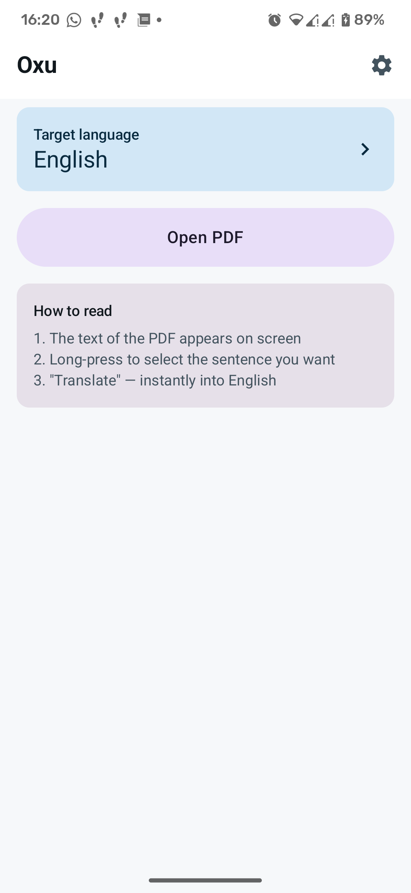
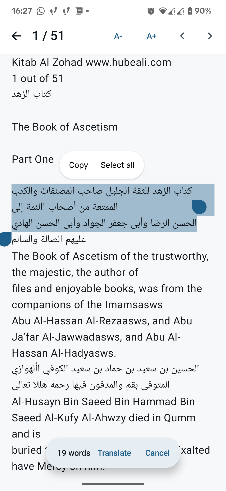
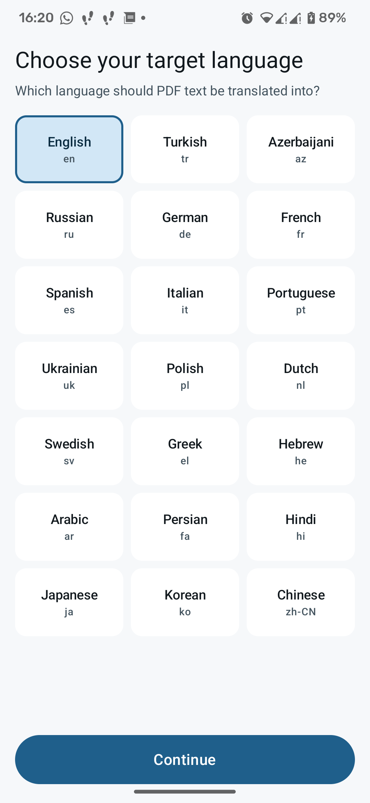
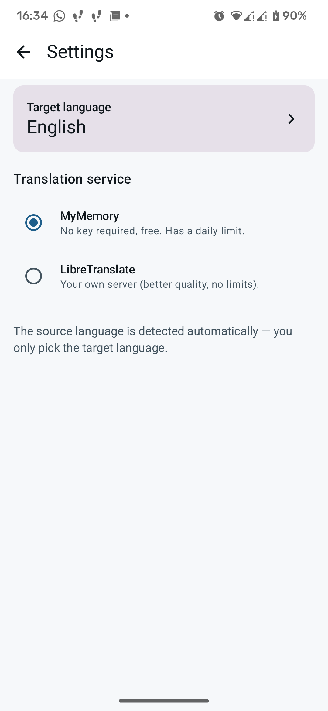

# Oxu


[](LICENSE)

**Read PDFs and translate any text you select — instantly.**

Oxu extracts the text of a PDF page by page, lets you select a sentence, and
translates it into your language. Nothing is stored on a server, the app has no
accounts, no tracking and no ads.

The source language is detected automatically by the translation service, so you
only ever pick the language you want to *read* in.

## Features

- Page-by-page text extraction from any PDF (text based, not scanned)
- Long-press to select text, then one tap to translate
- 21 target languages, adjustable text size, dark theme
- Recent files with the last page you were on
- Opens PDFs from the file manager or by sharing them into Oxu
- Two translation backends:
  - **MyMemory** — free, no API key, has a daily limit
  - **LibreTranslate** — your own server, better quality, no limits
- Fully offline for reading; only the text you select is sent for translation

## Screenshots

| Home | Reading a PDF |
| --- | --- |
|  |  |

| Selecting text | Translating |
| --- | --- |
|  |  |

| Choosing a language | Settings |
| --- | --- |
|  |  |

## Download

- **F-Droid** — _pending inclusion_
- **GitHub Releases** — <https://github.com/Prestgg1/oxu/releases>

The release APKs are signed. Verify the signature with:

```bash
apksigner verify --print-certs oxu-1.0.0.apk
```

## Build from source

Requirements: JDK 17 and the Android SDK (compile SDK 37, build tools 36).

```bash
./gradlew :app:assembleDebug
```

The APK will be at `app/build/outputs/apk/debug/app-debug.apk`.

### Signed release build

Put your keystore outside the repository and describe it in
`keystore.properties` in the project root (this file is git-ignored):

```properties
storeFile=/absolute/path/to/oxu-release.jks
storePassword=...
keyAlias=oxu
keyPassword=...
```

Then:

```bash
./gradlew :app:assembleRelease
```

Without `keystore.properties` the release build simply stays unsigned, which is
what F-Droid and CI need.

### Reproducible release build

F-Droid builds Oxu from source and publishes the result under **our** signing
key. For that to work, the build has to be byte-for-byte reproducible, so it has
to run exactly like F-Droid's does:

```bash
git clone https://github.com/Prestgg1/oxu.git && cd oxu
git checkout v1.0.0                    # a clean tree at the tagged commit
export JAVA_HOME=/path/to/jdk-21       # F-Droid builds with JDK 21

cd app                                  # the Gradle module, i.e. F-Droid's `subdir`
../gradlew assembleRelease

# same alignment F-Droid applies in its postbuild step
git clone https://gitlab.com/fdroid/reproducible-apk-tools.git
python3 ../reproducible-apk-tools/zipalign.py --page-size 16 --pad-like-apksigner \
    --replace app/build/outputs/apk/release/app-release-unsigned.apk aligned.apk

apksigner sign --ks <your.keystore> --v1-signing-enabled false aligned.apk
```

The four things that have to match, because each of them changes the bytes:

| | |
| --- | --- |
| **JDK 21** | a different JDK produces a slightly different `classes.dex` |
| **Clean tree at the tagged commit** | AGP embeds the git state in `META-INF/version-control-info.textproto` |
| **`app/` as the build root** | matches `subdir` in the build metadata |
| **The `zipalign.py` call above** | v1 signing must stay off, otherwise `META-INF/*.SF` files are added |

If you only care about running the app, `./gradlew :app:assembleDebug` is enough.

## Privacy

Oxu has no analytics and no network calls other than the translation request
you trigger. The selected text (and nothing else) is sent to the translation
service you chose in Settings. With LibreTranslate you can point the app at a
server you control, in which case the text never leaves your own infrastructure.

## How it works

- Text extraction: [PDFBox for Android](https://github.com/TomRoush/PdfBox-Android)
- UI: Jetpack Compose, Material 3
- Translation: MyMemory or LibreTranslate, plain HTTP client

## Contributing

See [CONTRIBUTING.md](CONTRIBUTING.md). Bug reports and pull requests are very
welcome.

## License

Oxu is free software released under the **GNU General Public License v3.0 or
later** — see [LICENSE](LICENSE).

Copyright (C) 2026 Prestgg1

This program is free software: you can redistribute it and/or modify it under
the terms of the GNU General Public License as published by the Free Software
Foundation, either version 3 of the License, or (at your option) any later
version.

This program is distributed in the hope that it will be useful, but WITHOUT ANY
WARRANTY; without even the implied warranty of MERCHANTABILITY or FITNESS FOR A
PARTICULAR PURPOSE. See the GNU General Public License for more details.
